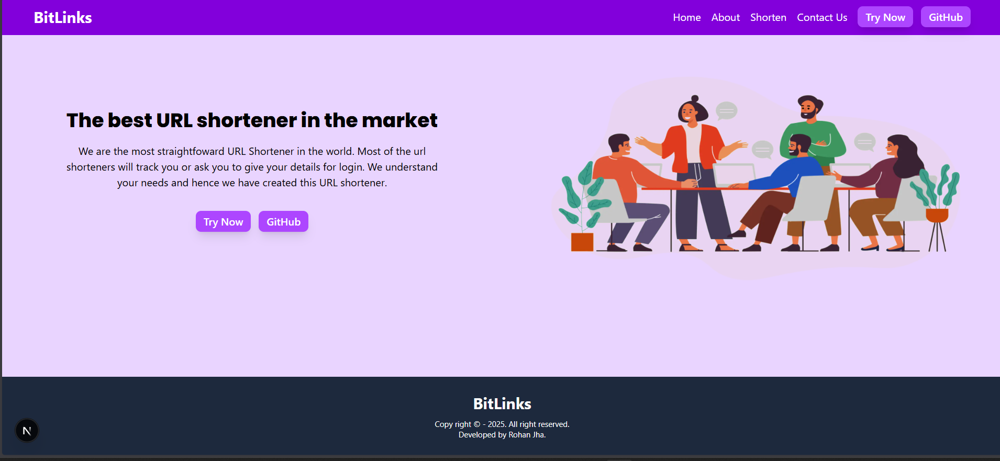

## 🔗 BitLinks – URL Shortener
```
BitLinks is a modern, fast, and privacy-focused URL shortener built using Next.js (App Router) and Tailwind CSS.
It allows users to generate short URLs instantly and redirects them using dynamic routes, without requiring login or tracking user data.
```
## 📸 Screenshots

### 🖥️ App Interface


## ✨ Features

• 🔗 Generate short URLs instantly

• 🚀 Redirect short URLs using dynamic routes (/[shorturl])

• 🗄️ Store original & short URLs securely in MongoDB

• ⚡ Built with Next.js App Router

• 🎨 Clean, modern & fully responsive UI using Tailwind CSS

• 🧪 API tested using Postman

• 🔐 No authentication required (simple & straightforward)

• 🌐 Client-side + server-side handling with API routes

## 🛠️ Tech Stack

### Frontend:

• Next.js 14 (App Router)

• Tailwind CSS

### Backend:

• Next.js API Routes

• MongoDB (Node.js Driver v7)

### Tools & Utilities:

• Postman (API testing)

• Dynamic Routing (app/[shorturl]/page.js)

## 🔁 How URL Redirection Works

-> User generates a short URL (e.g. http://localhost:3000/abc123)

-> Short URL + original URL is saved in MongoDB

-> When the short URL is accessed:

-> Next.js dynamic route /[shorturl] fetches the original URL

-> User is redirected automatically

## 👨‍💻 Developer
Developed by: Rohan Jha
