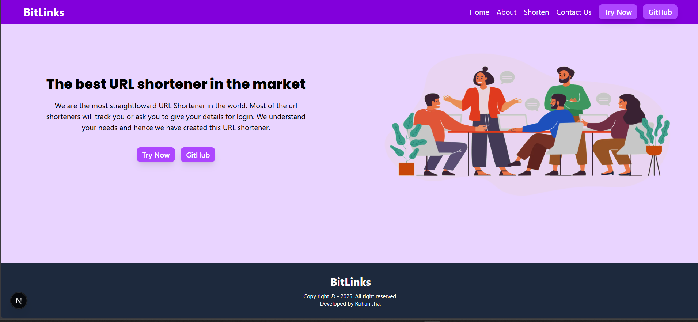

## 🔗 BitLinks – URL Shortener

BitLinks is a modern, fast, and privacy-focused URL shortener built using **Next.js (App Router)** and **Tailwind CSS**. It allows users to generate short URLs instantly, with either custom aliases or auto-generated ones. It safely stores and dynamically redirects URLs using server-side routing, without requiring a login or tracking private user data.

## 📸 Screenshots

### 🖥️ App Interface

## ✨ Features

- 🔗 **Generate Short URLs Instantly:** Create short links with custom aliases or let the system auto-generate them.
- 🚀 **Server-Side Redirection:** Lightning-fast redirection using Next.js dynamic API routes (`app/[shorturl]/route.js`).
- 🛡️ **URL Validation:** Backend checks prevent malicious or malformed links from being created.
- 🗄️ **MongoDB Storage:** Original and short URLs, along with click counts, are securely stored in a cloud MongoDB Atlas database.
- 🎨 **Modern & Responsive UI:** Clean interface styled with Tailwind CSS.
- 🔔 **Interactive Feedback:** Real-time success and error popups using `react-toastify`.
- 🔐 **No Authentication Required:** Simple and straightforward access for everyone.

## 🛠️ Tech Stack

### Frontend
- Next.js (App Router)
- React
- Tailwind CSS
- React Toastify

### Backend
- Next.js API Routes
- MongoDB (Node.js Driver)
- MongoDB Atlas (Cloud Database)

### Deployment
- Vercel (CI/CD and Hosting)

## 🔁 How URL Redirection Works

1. User submits a long URL with an optional preferred alias.
2. The API validates the URL and ensures the alias doesn't already exist.
3. The short URL and original URL are saved in MongoDB.
4. When the short URL is accessed (e.g., `bitlinks.vercel.app/alias`), the Next.js dynamic route `/[shorturl]` intercepts the request.
5. The server fetches the original URL and redirects the user automatically.

## 👨‍💻 Developer
Developed by: **Rohan Jha**
